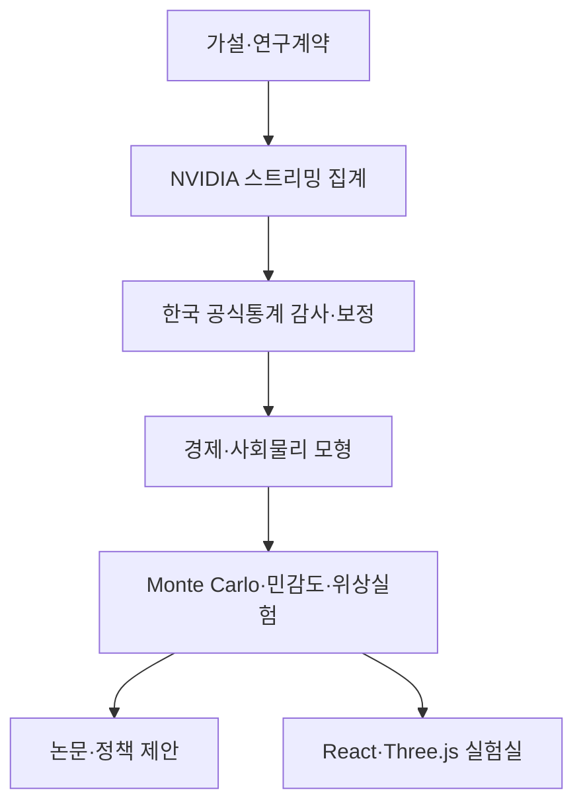

# NVIDIA Korea Econophysics Lab Skill

NVIDIA의 한국 합성 페르소나를 이용해 경제물리·사회물리 연구, 한국 맞춤형 정책 실험, 논문, React/TypeScript/Three.js 시뮬레이터를 일관된 방법으로 만드는 Codex·ChatGPT 스킬입니다.

> 저장소 이름에는 역사적으로 `NVIDA`가 들어가 있지만, 회사와 데이터셋의 올바른 표기는 **NVIDIA**입니다.

## 이 스킬이 해결하는 문제

NVIDIA의 [Nemotron-Personas-Korea](https://huggingface.co/datasets/nvidia/Nemotron-Personas-Korea)는 한국의 인구·지역 분포를 참고해 만든 대규모 합성 데이터입니다. 데이터 카드 기준으로 100만 레코드, 700만 페르소나, 26개 필드, 17개 시도와 약 252개 시군구를 포함하며 CC BY 4.0으로 공개되었습니다.

하지만 이 자료를 그대로 “한국인 100만 명의 조사 결과”처럼 해석하면 안 됩니다. 모든 레코드는 완전 합성이며, 일부 변수는 독립성 가정으로 생성되어 성별×교육×직업과 같은 결합분포의 교호작용이 실제 사회와 다를 수 있습니다.

이 스킬은 다음 원칙을 자동으로 적용합니다.

- 이름·UUID·자연어 페르소나를 연구 산출물에서 제외
- 연령×성별×지역×교육×광의 직업으로만 집계
- KOSIS·지역별 고용조사·KLIPS·한국은행 자료로 결합분포와 전이율 감사
- 합성자료의 역할을 모집단 추정이 아닌 이질적 에이전트 구성과 스트레스 테스트로 제한
- 경제모형, Python 실험, 논문 수식, React 시뮬레이터의 버전을 일치
- Monte Carlo, 메커니즘 제거실험, 전역 민감도, 유한크기, 위상경계 검증을 완료해야 연구 완성으로 판정

## 주요 활용 분야

| 분야 | 가능한 연구 질문 |
|---|---|
| 소버린·공공 AI | 전 국민 무료 AI가 접근 격차는 줄여도 소득 양극화를 남기는 조건은 무엇인가? |
| 노동경제 | AI 노출·보완성·직무이동성이 청년 경력사다리와 중간층에 미치는 영향은 무엇인가? |
| 지역경제 | 수도권과 비수도권의 조직 지원·인프라·학습 네트워크 격차는 어떻게 확산되는가? |
| 분배·자산경제 | 현금 이전과 시민·근로자 AI 지분 중 어느 방식이 장기 자본집중을 낮추는가? |
| 경제물리 | 품질격차·직무이동성 변화에서 양극화의 임계영역, 유한크기 스케일링, 이력현상이 나타나는가? |
| 사회물리 | 동질적 네트워크와 동료학습이 AI 역량의 군집화·확산·분극을 어떻게 바꾸는가? |
| 경제학 교육 | 학생이 가설, 합성 인구, ABM, 민감도, 정책 보고서, 웹 데모를 한 학기 프로젝트로 완성할 수 있는가? |

## 연구 워크플로



## 저장소 구조

```text
NVIDA_KOREAN_agents_experiment_skill/
├── README.md
├── requirements.txt
├── examples/
│   ├── experiment-spec.example.json
│   └── nvidia-korea-profile.example.json
├── tests/
│   └── test_profile_tools.py
└── nvidia-korea-econophysics-lab/
    ├── SKILL.md
    ├── agents/openai.yaml
    ├── scripts/
    │   ├── prepare_nvidia_korea_profile.py
    │   ├── profile_contract.py
    │   └── validate_nvidia_korea_profile.py
    └── references/
        ├── data-governance.md
        ├── model-and-experiments.md
        ├── simulation-and-publication.md
        ├── experiment-recipes.md
        └── sources.md
```

## 설치 방법

OpenAI의 [Build skills 공식 문서](https://learn.chatgpt.com/docs/build-skills)에 따라 독립 스킬은 사용자 범위의 `$HOME/.agents/skills` 또는 프로젝트의 `.agents/skills`에서 사용할 수 있습니다.

### 방법 1: Codex의 skill-installer 사용

Codex에서 `$skill-installer`를 호출하고 다음 주소의 `nvidia-korea-econophysics-lab` 폴더를 설치해 달라고 요청합니다.

```text
https://github.com/waterfirst/NVIDA_KOREAN_agents_experiment_skill/tree/main/nvidia-korea-econophysics-lab
```

### 방법 2: Windows PowerShell에서 사용자 스킬로 설치

```powershell
git clone https://github.com/waterfirst/NVIDA_KOREAN_agents_experiment_skill.git
New-Item -ItemType Directory -Force "$env:USERPROFILE\.agents\skills"
Copy-Item -Recurse -Force `
  ".\NVIDA_KOREAN_agents_experiment_skill\nvidia-korea-econophysics-lab" `
  "$env:USERPROFILE\.agents\skills\"
```

### 방법 3: Linux·macOS에서 사용자 스킬로 설치

```bash
git clone https://github.com/waterfirst/NVIDA_KOREAN_agents_experiment_skill.git
mkdir -p "$HOME/.agents/skills"
cp -R NVIDA_KOREAN_agents_experiment_skill/nvidia-korea-econophysics-lab \
  "$HOME/.agents/skills/"
```

특정 저장소에서만 사용하려면 해당 프로젝트의 `.agents/skills/` 아래에 같은 폴더를 복사합니다. 설치 목록이 즉시 보이지 않으면 Skills 화면을 새로 열거나 새 대화에서 확인합니다.

## 호출 방법

ChatGPT Work에서는 `@nvidia-korea-econophysics-lab`, Codex CLI·IDE에서는 `$nvidia-korea-econophysics-lab`로 명시적으로 호출할 수 있습니다. 다음처럼 자연어로 요청해도 설명과 일치하면 자동으로 선택될 수 있습니다.

```text
NVIDIA 한국 합성 페르소나를 이용해 공공 AI 무료 보급과 소득 양극화를
분석하는 경제물리 ABM, 논문, React/Three.js 시뮬레이터를 만들어줘.
```

## 빠른 시작: NVIDIA 프로필 만들기

### 1. 선택 의존성 설치

```bash
python -m pip install -r requirements.txt
```

### 2. Hugging Face에서 필요한 행만 스트리밍 집계

전체 4GB 이상 데이터를 저장하지 않고 필요한 행만 읽습니다.

```bash
python nvidia-korea-econophysics-lab/scripts/prepare_nvidia_korea_profile.py \
  --rows 100000 \
  --region-mode province \
  --occupation-mode broad \
  --min-cell 5 \
  --output data/nvidia-korea-profile.json
```

보안망이나 오프라인 환경에서는 구조 필드만 포함한 JSONL을 준비한 뒤 `--input-jsonl path/to/input.jsonl`을 사용합니다.

### 3. 프로필 엄격 검증

```bash
python nvidia-korea-econophysics-lab/scripts/validate_nvidia_korea_profile.py \
  data/nvidia-korea-profile.json \
  --strict \
  --report results/profile-validation.json
```

검증기는 다음을 실패 처리합니다.

- 스키마 버전·필수 키·라이선스 오류
- 합계 불일치, 중복 층, 비정상 count
- `uuid`, 이름, 페르소나, 취미·관심·목표 등 금지 필드
- 허용되지 않은 차원이나 age group

`--strict`에서는 미상 비중 과다, 지나치게 작은 표본, 단일 층 집중 등의 경고도 실패로 처리합니다.

## 집계 JSON 계약

```json
{
  "schemaVersion": 1,
  "source": "NVIDIA Nemotron-Personas-Korea",
  "dataset": "nvidia/Nemotron-Personas-Korea",
  "datasetVersion": "1.0",
  "license": "CC BY 4.0",
  "sampleSize": 100000,
  "retainedSampleSize": 99980,
  "strata": [
    {
      "ageGroup": "50-64",
      "sex": "여성",
      "region": "경기",
      "education": "고등학교",
      "occupation": "서비스·돌봄",
      "count": 120
    }
  ]
}
```

프로필은 에이전트 초기화용 층화분포일 뿐, 소득·AI 사용·정책 선호를 관측한 자료가 아닙니다.

## 경제물리·사회물리 모형의 기본 뼈대

무료 접근과 실질 편익을 구분합니다.

$$
z_i(t)=A_i(t)Q_i(t)a_i(t)\left[s_i(t)+\lambda\sum_j\widetilde G_{ij}s_j(t)\right]
$$

- $A_i$: 접근 가능성
- $Q_i$: 품질·신뢰성·조직지원·지역 인프라를 포함한 실효 품질
- $a_i$: 채택 강도
- $s_i$: AI 활용 역량
- $\widetilde G$: 동질성·교량연결을 포함한 사회 네트워크

따라서 모든 국민에게 같은 계정을 무료로 나누어도 역량, 직무 보완성, 이동 가능성, 조직 지원, 돌봄시간, AI 자본소유가 다르면 소득과 부의 양극화는 남을 수 있습니다.

권장 지표는 Gini, Atkinson, Theil, Palma, Wolfson, 중간소득층 비중, EDE 소득, 직업이동성, 취약고용, 지역·교육별 실효 AI 격차, 상위 10% AI 자본 몫입니다. 경제물리 주장을 할 경우 군집크기, susceptibility, order parameter, 유한크기 스케일링, 이력현상까지 검증합니다.

## 사용 예제

### 예제 1: 무료 공공 AI와 양극화

```text
@nvidia-korea-econophysics-lab
무료 소버린 AI가 접근 격차는 줄이지만 역량·직무이동·프리미엄 품질·AI 자본소유 때문에
소득 양극화를 남기는 조건을 검증하라. Python ABM, paired Monte Carlo, 위상도,
JEIC 논문 초안, React/Three.js 시뮬레이터를 같은 모형 버전으로 만들어라.
```

### 예제 2: 청년 경력사다리

```text
@nvidia-korea-econophysics-lab
AI가 주니어의 정형 업무를 대체해 learning-by-doing과 직업진입을 약화시키는 모형을 만들라.
도제·멘토링 보장, 채용보조, 직무전환, 무료 AI 정책을 동일 예산으로 비교하라.
```

### 예제 3: 지역 사회물리

```text
@nvidia-korea-econophysics-lab
한국 지역별 동질적 네트워크에서 AI 역량 확산과 군집화를 분석하라.
지역 AI 허브, 로컬 멘토, 원격교육, 지역 간 교량연결의 효과를 비교하라.
```

### 예제 4: 배당과 소유권

```text
@nvidia-korea-econophysics-lab
현금 배당, 누진적 AI 배당, 시민 AI 펀드, 근로자 지분을 동일 비용으로 비교하고
20년간 노동소득·자본소득·부의 집중·후생·이력현상을 분석하라.
```

### 예제 5: 경제학과 수업

```text
@nvidia-korea-econophysics-lab
학생들이 한 학기 동안 가설 1개, 공식통계 보정 2개, 2×2 요인실험,
ABM 검증, 논문형 보고서, 인터랙티브 대시보드를 완성하는 과제를 설계하라.
```

추가 레시피는 [experiment-recipes.md](nvidia-korea-econophysics-lab/references/experiment-recipes.md)에 있습니다.

## 논문 수준의 완료 조건

- NVIDIA 데이터 카드의 버전·라이선스·한계를 기록했는가?
- 개인 식별자와 서술형 페르소나가 결과 파일에 없는가?
- 한국 공식 통계의 결합분포와 전이율로 감사했는가?
- 각 파라미터가 추정·보정·문헌·시나리오·정규화 중 무엇인지 표시했는가?
- 공통 난수와 동일 초기집단으로 정책을 paired 비교했는가?
- Monte Carlo 신뢰구간, 메커니즘 제거, 전역 민감도, 유한크기 검사를 했는가?
- 경제물리 논문이라면 임계영역·스케일링·이력현상을 검증했는가?
- 논문 수식, Python, TypeScript, CSV 결과가 같은 모델 버전인가?
- 결과를 예측·인과효과가 아닌 `모형 조건부 비교정태`로 정확히 표현했는가?

## 학술지 선택

| 연구의 실제 기여 | 우선 검토 대상 |
|---|---|
| 이질적 경제주체·정책·분배·복잡계 경제 | Journal of Economic Interaction and Coordination |
| 투명한 생성적 ABM·사회 네트워크·ODD·재현성 | Journal of Artificial Societies and Social Simulation |
| 한국 보정 계산사회과학·합성자료 책임성 | Journal of Computational Social Science |
| 보정·후생·수치경제·구조적 비교 | Computational Economics |
| 질서변수·상전이·스케일링·보편성·이력현상 | Physica A |

단순히 ABM과 Three.js를 사용했다는 이유만으로 경제물리 논문이 되지는 않습니다. 위상전이와 통계물리적 기여가 약하면 JEIC·JASSS·계산사회과학 경로가 더 적합합니다.

## 검증

```bash
python -m unittest discover -s tests -v
python /path/to/skill-creator/scripts/quick_validate.py \
  nvidia-korea-econophysics-lab
```

테스트는 정상 프로필, 금지 필드, 합계 불일치, 집계 정규화를 확인합니다.

## 관련 구현

이 스킬의 연구 패턴은 [Public AI Inequality Economics](https://github.com/waterfirst/public-ai-inequality-economics)의 논문·한국 정책 설계·React/Three.js 실험실에서 출발했습니다. 공개 실행 화면은 [Public AI Inequality Policy Lab](https://waterfirst.github.io/public-ai-inequality-economics/)에서 확인할 수 있습니다.

## 데이터 이용과 인용

- NVIDIA 데이터: CC BY 4.0. 데이터 카드와 NVIDIA를 명시적으로 인용하십시오.
- 이 저장소는 원본 NVIDIA 레코드나 자연어 페르소나를 재배포하지 않습니다.
- `examples/nvidia-korea-profile.example.json`은 형식 검증용 가상 예제이며 NVIDIA 실제 분포가 아닙니다.
- 정책·학술 결과에는 사용한 공식 통계표, 기준연도, 모집단, 보정 방식, 가중치 범위를 함께 공개하십시오.

핵심 참고문헌과 공식 자료는 [sources.md](nvidia-korea-econophysics-lab/references/sources.md)에 정리되어 있습니다.
